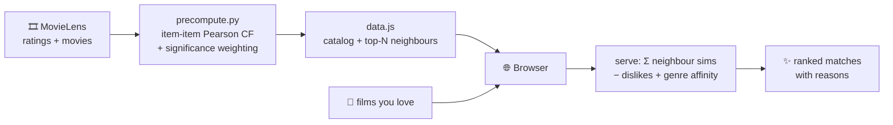

# 🎬 Movie Recommender System — PySpark + a playable UI

A hybrid movie recommender built on **Apache Spark / PySpark**, plus **CineMatch** — a fun, zero-backend web app that turns the model into something you can actually play with: tap the films you love, get personalized matches with reasons.

<p>
  
  
  
  
</p>

There are **two ways** to explore this project:

| | What | Where |
|---|---|---|
| 🍿 **Play** | CineMatch — pick films you love, get matches in the browser | [`webapp/`](webapp/) |
| 🔬 **Study** | The Spark research pipeline — ALS + item-item CF + RF hybrid | [`movie_recommender_system.py`](movie_recommender_system.py) |

---

## 🍿 CineMatch — the recommender, made playable

Pick the films that stuck with you → get a ranked list of what to watch next, each with a **match %** and a plain-English reason (*"Loved by fans of Forrest Gump & The Silence of the Lambs"*). Reject a suggestion and the list re-tunes instantly.

It's the project's **item-item collaborative filtering** idea, precomputed locally (no Spark/HDFS) and served entirely client-side — so it runs by **double-clicking a file**.

### Quick start

```bash
# Option A — just open it
open webapp/index.html            # (double-click also works; data is baked in)

# Option B — tiny static server
cd webapp && python3 -m http.server 8899   # → http://localhost:8899
```

No install, no build, no API keys.

### What you get

- **Discover** — browse/search ~5,000 films, filter by genre, tap to add to your reel
- **For You** — ranked matches with match %, "because you liked…" reasons, and your taste profile
- **Refine** — *Love it* / *Not for me* on any match re-scores everything live
- **Signature touches** — generated per-genre poster art, a filmstrip picks tray with real sprocket holes, fully responsive, picks saved across refreshes



### How it maps to the Spark model

The Spark pipeline's item-item CF stage (`compute_similarity`) computes, for every movie pair, the **Pearson correlation** of their mean-centred ratings over users who rated both. `webapp/precompute.py` reproduces that stage with plain Python + numpy, then adds two production touches so neighbours are good on a small, sparse dataset:

| Spark `compute_similarity`            | `precompute.py`                          |
| ------------------------------------- | ---------------------------------------- |
| `norm_rating = rating − mean_rating`  | mean-centre each movie's ratings         |
| `sum_xy / (√sum_xx · √sum_yy)`        | Pearson over co-rating users             |
| *(no minimum co-raters)*              | **≥ 8 shared raters** required per pair  |
| —                                     | **significance weighting** `sim × n/(n+25)` |

> **Why it matters:** raw Pearson on `latest-small` happily returns 0.97 for two obscure films that share five raters. The quality gate + shrinkage fix that:
> *Toy Story → Percy Jackson, Tom & Huck* ❌ &nbsp;→&nbsp; *Toy Story → Toy Story 2, Finding Nemo, The Incredibles* ✅

At serving time the browser does the other half of item-item CF: sum the precomputed neighbour similarities across your liked set, subtract the pull of anything you rejected, and blend in a light genre-affinity signal (a nod to the Spark hybrid's genre-based Random Forest). Full details in [`webapp/README.md`](webapp/README.md).

---

## 🔬 The Spark research pipeline

`movie_recommender_system.py` builds a hybrid recommender on the MovieLens **25M** dataset, designed to run on a Spark cluster over HDFS.

### 1. Alternating Least Squares (ALS)
Matrix-factorization collaborative filtering via Spark MLlib, with **cross-validated** hyperparameter tuning (`rank`, `maxIter`, `regParam`). Evaluated with RMSE, MSE, and MAP.

### 2. Item-Item Collaborative Filtering
Custom **Pearson-correlation** similarity between movies (mean-centred ratings, co-rating users), used to generate neighbour-based predictions.

### 3. Hybrid Recommender
- **v1** — weighted blend of ALS + item-item CF
- **v2** — adds a **Random Forest Regressor** trained on one-hot movie genres, with a grid search over component weights to minimize RMSE

### Results

| Model | RMSE |
| --- | --- |
| ALS | 0.845 |
| Hybrid (ALS + item-item CF) | 0.16 |
| Best hybrid (ALS + item-item CF + Random Forest) | 0.43 |

### Run the Spark pipeline

1. Install Apache Spark + PySpark.
2. Download the [MovieLens 25M](https://grouplens.org/datasets/movielens/25m/) dataset and update the HDFS paths in the script.
3. Submit it:
   ```bash
   spark-submit movie_recommender_system.py
   ```

---

## 🗂️ Project structure

```
spark-movie-recommendation/
├── movie_recommender_system.py   # PySpark hybrid pipeline (ALS + CF + RF)
├── webapp/                        # CineMatch — zero-backend UI
│   ├── index.html                #   structure
│   ├── css/style.css             #   cinematic look
│   ├── js/app.js                 #   in-browser recommender + rendering
│   ├── data.js                   #   generated: catalog + neighbours (~1.4 MB)
│   ├── precompute.py             #   offline item-item Pearson CF → data.js
│   └── README.md                 #   UI ↔ Spark model mapping
└── README.md
```

> The raw MovieLens CSVs aren't committed; `webapp/precompute.py` auto-downloads `latest-small` (~1 MB) from GroupLens when you regenerate `data.js`.

## 🧰 Tech stack

Apache Spark · PySpark MLlib (ALS, RandomForest, cross-validation) · Python + numpy (offline precompute) · vanilla HTML/CSS/JS (no framework, no build)

## 🚀 Future improvements

- Poster art from TMDB/IMDB (the app ships `tmdbId`/`imdbId` per film)
- An ALS-style "users like you also watched" mode in the UI
- User demographics and richer metadata features
- Deep-learning recommenders and real-time updates

## 📚 Data & attribution

Built on the **MovieLens** datasets, courtesy of [GroupLens Research](https://grouplens.org/datasets/movielens/). Movie metadata and derived similarity data in `webapp/data.js` are redistributed under the MovieLens usage terms (non-commercial; same-license redistribution). Please cite:

> F. Maxwell Harper and Joseph A. Konstan. 2015. *The MovieLens Datasets: History and Context.* ACM Transactions on Interactive Intelligent Systems (TiiS) 5, 4: 19:1–19:19. https://doi.org/10.1145/2827872
